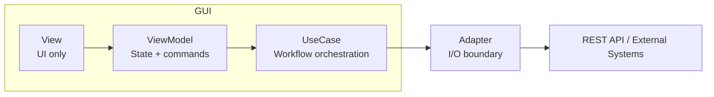
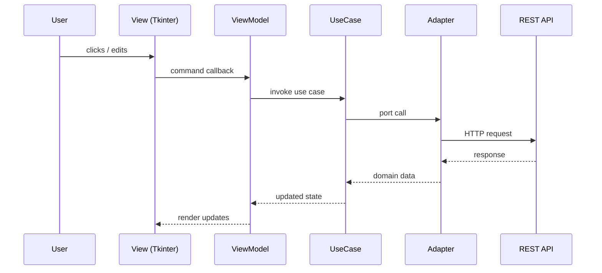

# Architecture Overview (GUI + REST API)

The SEVA GUI (`seva/`) follows MVVM + Hexagonal architecture and talks to the FastAPI service (`rest_api/`) through adapter ports.

## Layer Responsibilities

- Views render UI only.
- ViewModels expose UI state and commands only.
- UseCases orchestrate workflows.
- Adapters handle external I/O (HTTP, filesystem, discovery).
- Domain modules own shared types, validation, naming, and normalization.

## Cross-System Call-Chain

A typical user action flows as:

1. Tkinter view event in `seva/app/views/*`.
2. ViewModel command in `seva/viewmodels/*`.
3. UseCase orchestration in `seva/usecases/*`.
4. Adapter port call in `seva/adapters/*`.
5. REST endpoint in `rest_api/app.py` and helper modules.

