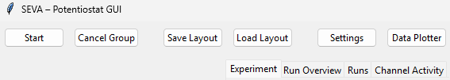
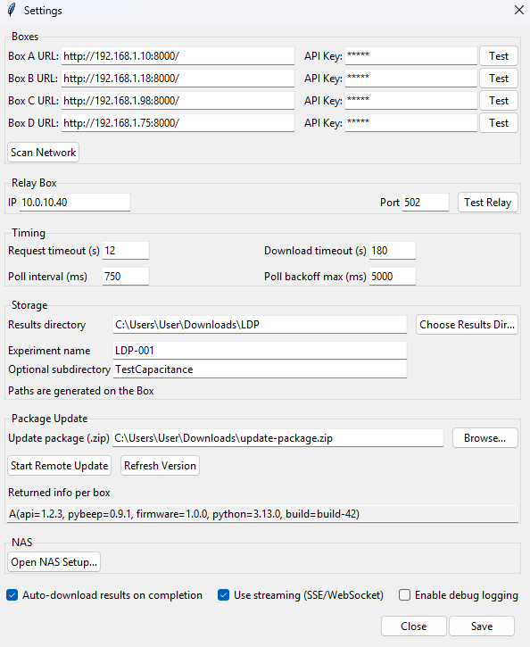
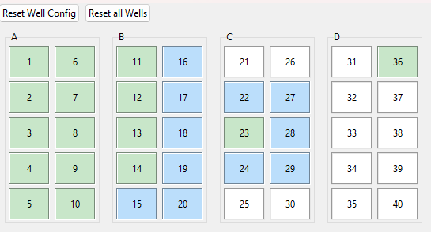
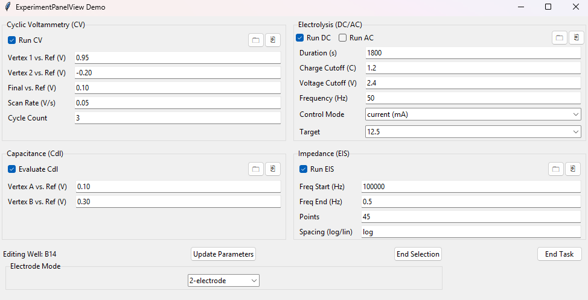
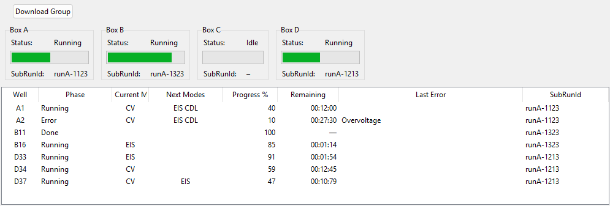
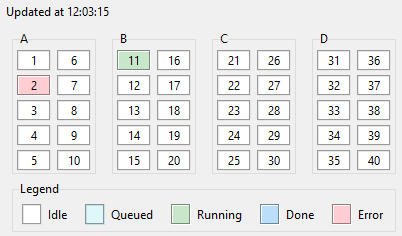
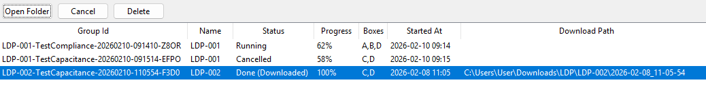
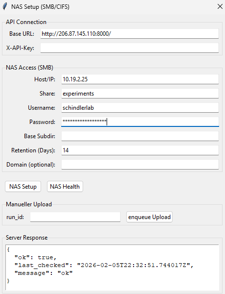

# GUI Overview & How to Use (End-User Tutorial)

This guide explains the SEVA GUI from an end-user perspective.

- Focus: **what is where** and **what each function is for**.
- Scope: complete workflow from setup to download.
- For architecture and code details, see [Architecture Overview](architecture_overview.md), [SEVA GUI Workflows](workflows_seva.md), and [SEVA GUI Classes & Modules](classes_seva.md).

---

## 1) Main window orientation

The main window is your starting point.

### Toolbar (top)

- **Start**: starts a new run group with the current plate/well configuration.
- **Cancel Group**: cancels the currently active run group.
- **Save Layout / Load Layout**: save or restore plate configuration presets.
- **Settings**: open connectivity, storage, timing, relay, firmware, and NAS options.
- **Data Plotter**: open the plotting tool for downloaded data.

### Tabs (right side)

- **Experiment**: define CV / DC-AC / Cdl / EIS parameters.
- **Run Overview**: monitor group progress and trigger group download.
- **Runs**: browse completed/running groups and open their folders.
- **Channel Activity**: quick per-channel status view.

---

## 2) First-time setup (required before starting runs)

Open **Settings** from the toolbar.

### Boxes

- Enter **Box A/B/C/D URL**.
- Enter **API Key** (if required by your deployment).
- Use **Test** per box to verify connectivity.
- Use **Scan Network** to discover available devices automatically.

**Feature detail:** discovery is not a blind scan only. The app uses your configured box URLs as discovery candidates and also derives subnet hints (for example `/24`) from those URLs, then deduplicates the candidate list before scanning.

### Relay box

- Configure relay controller **IP** and **Port**.
- Use **Test Relay** to verify relay communication.

### Timing

- Set request, polling, and download timeout values.
- Keep defaults unless your network/API behavior requires tuning.

### Storage

- Set local **Results directory**.
- Set **Experiment name** and optional subdirectory for organized output.

### Firmware

- Select a `.bin` image and use **Flash Firmware** when needed.

### NAS (advanced / optional)

- Use **Open NAS Setup...** for SMB/NAS upload workflows.

### Flags

- **Auto-download results on completion**: downloads automatically when all runs finish.
- **Use streaming (SSE/WebSocket)**: reserved toggle for streaming-capable deployments; default production run monitoring remains polling-based.
- **Enable debug logging**: increases log detail for diagnostics.

Finish by pressing **Save**.

**Feature detail:** saving settings performs validation first. The selected Results directory must exist and be writable, and the app shows an HTTPS warning dialog if box URLs use `https://` in environments that commonly run HTTP-only backend endpoints.

---

## 3) Optional: discover devices from the network

When you run network discovery, this result dialog shows detected SEVA devices.

Use this to confirm that expected boxes are reachable and to validate API/build information.

---

## 4) Configure wells and methods

### 4.1 Select wells in the grid

Use the well grid to choose which channels/wells should run.

- **Reset Well Config**: clears configuration for the currently selected well(s).
- **Reset all Wells**: clears the full plate configuration.

**Feature detail:** the grid supports several interaction patterns.
- Single click selects one well.
- Shift+click toggles multi-selection.
- Right-click opens a context menu with copy/paste/reset/enable-toggle/open-PNG actions for fast editing flows.

### 4.2 Set experiment parameters

In the **Experiment** tab, define methods and parameters.

Available sections:

- **Cyclic Voltammetry (CV)**
- **Electrolysis (DC/AC)**
- **Capacitance (Cdl)**
- **Impedance (EIS)**

Key actions:

- Enable/disable each method using its checkbox.
- Edit numeric parameters and control mode/targets where applicable.
- **Update Parameters** applies values to selected wells.
- **End Selection** ends the current selection workflow.
- **End Task** ends active task context from the panel.

---

## 5) Start and monitor a run

### 5.1 Start

From the toolbar, click **Start**.

### 5.2 Run Overview tab

Use **Run Overview** to monitor active progress and status.

- Top cards show status per box (A/B/C/D).
- Table shows per-well information (phase, mode, progress, remaining time, last error, sub-run ID).
- **Download Group** triggers a full group results download.

**Feature detail:** if a row contains a long error message, double-click that row to open a full error dialog and copy the text (useful for support/tickets).

### 5.3 Channel Activity tab

Use **Channel Activity** for quick channel-state visibility.

---

## 6) Manage run history and download folders

In the **Runs** tab, manage existing run groups.

- **Open Folder**: opens the selected run group directory.
- **Cancel**: requests cancel for selected running group.
- **Delete**: removes selected row(s) from the list/history view.

**Feature detail:**
- Action buttons are enabled only when a row is selected.
- Cancel/Delete actions include confirmation dialogs in active-run cases.
- This tab is intended for post-start run lifecycle management (open, cancel, remove history entries).

Table columns include group ID, name, status, progress, boxes, start time, and download path.

---

## 7) Plot and export data

Open **Data Plotter** from the toolbar after data is available locally.

Typical use:

1. Select your CSV input.
2. Choose axis options and optional integration controls.
3. Apply optional IR correction.
4. Save/export the resulting data/plots.

This view is focused on plotting and export operations from already downloaded data.

---

## 8) Optional advanced workflow: NAS setup

Use NAS setup if your process requires SMB upload/retention handling.

Typical fields:

- API connection (Base URL + API key)
- SMB host/share/credentials
- Retention days
- Manual upload by run ID
- Health checks and server response panel

Use this only when your lab flow includes NAS archiving.

---

## 9) Typical end-to-end workflow (quick checklist)

1. Open **Settings** and configure box URLs/API keys.
2. Test connectivity (and relay if used).
3. Set results directory and save settings.
4. Select wells in **Well Grid**.
5. Configure methods in **Experiment** and apply parameters.
6. Click **Start**.
7. Monitor in **Run Overview** and **Channel Activity**.
8. Download via **Download Group** (or auto-download).
9. Open files in **Runs** tab.
10. Optional: inspect/export in **Data Plotter**.

If anything fails, see [Troubleshooting](troubleshooting.md).

---
