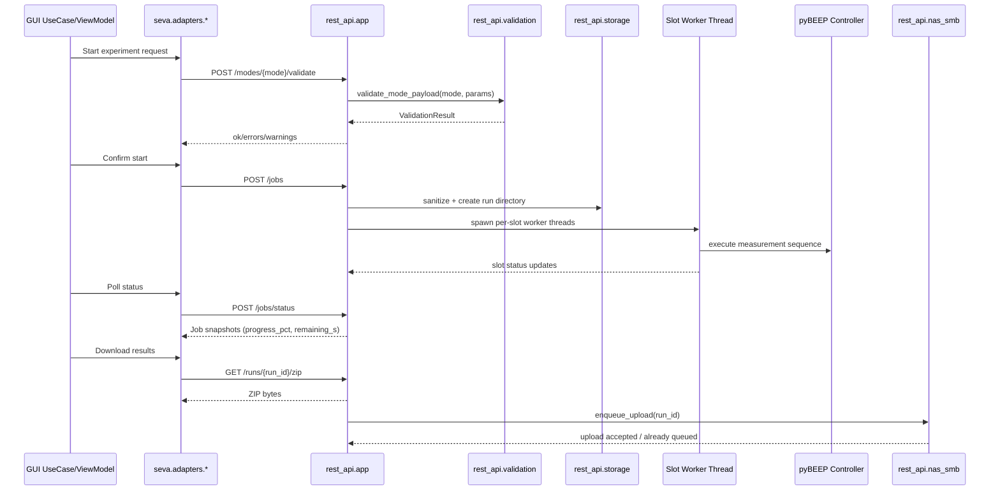

# REST API Workflows

This document captures the end-to-end workflows that GUI code triggers in the REST API.

## GUI caller map

- `seva/adapters/device_rest.py` -> discovery and mode metadata endpoints.
- `seva/adapters/job_rest.py` -> validation/start/status/cancel/download endpoints.
- `seva/adapters/firmware_rest.py` -> firmware upload endpoint.
- `seva/adapters/discovery_http.py` -> `/health` probe during box discovery.

The corresponding usecases include experiment launch/poll/cancel flows and firmware flashing flows in `seva/usecases/`.

## Workflow 1: Validate -> Start -> Poll -> Download

1. GUI collects form inputs and calls `POST /modes/{mode}/validate`.
2. `app.py` delegates to `validation.validate_mode_payload(...)`.
3. On success, GUI posts `POST /jobs` with `JobRequest` payload.
4. `app.py` validates slots + mode payload presence, sanitizes storage names through `storage.py`, creates run directory, and starts slot worker threads.
5. GUI polls status via `POST /jobs/status` (bulk) and/or `GET /jobs/{run_id}`.
6. `job_snapshot(...)` computes server-authoritative `progress_pct` and `remaining_s` via `progress_utils.compute_progress(...)`.
7. After completion, GUI downloads artifacts via `GET /runs/{run_id}/zip` (or per-file endpoints).

## Workflow 2: Cancel and cleanup

1. GUI sends `POST /jobs/{run_id}/cancel`.
2. API sets cancellation flag and immediately marks queued slots as cancelled.
3. Running worker loops observe the cancel flag and attempt controller abort.
4. API recomputes aggregate job state and frees slot reservations.
5. Clients observe terminal state via polling endpoints.

## Workflow 3: NAS setup, health, and upload

1. GUI posts SMB credentials to `POST /nas/setup`.
2. `nas_smb.NASManager.setup(...)` writes config/credentials and runs a probe mount.
3. GUI checks connectivity with `GET /nas/health`.
4. Upload can be triggered manually via `POST /runs/{run_id}/upload` or by post-run automation in worker code.
5. Upload worker mounts the share, copies files, verifies counts, and writes `UPLOAD_DONE` marker.
6. Retention loop removes old locally uploaded runs based on configured retention days.

## Workflow 4: Firmware flashing

1. GUI uploads `.bin` via `POST /firmware/flash`.
2. API stores file in `/opt/box/firmware` with sanitized filename.
3. API runs `python auto_flash_linux.py <bin-path>`.
4. Script sends boot command, flashes with `dfu-util`, and waits for CDC reconnection.
5. API returns command stdout/stderr and exit code; failures are mapped to typed API error payloads.

## Workflow 5: Telemetry stream demo

1. Client calls `/api/telemetry/temperature/latest` to fetch cache snapshot.
2. Client opens SSE stream `/api/telemetry/temperature/stream`.
3. API emits `temp` events and periodic `ping` keepalive events.
4. `latest_by_dev` cache updates continuously and remains available for snapshot endpoint.

## Sequence diagram

