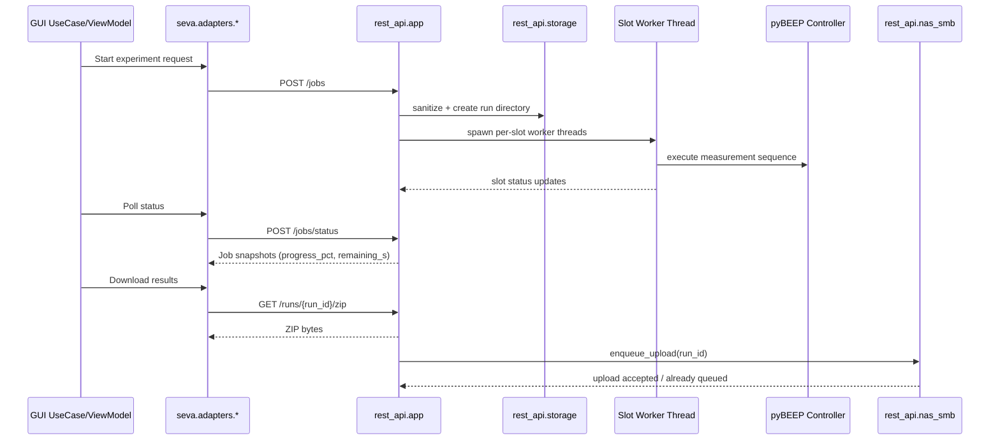

# REST API Workflows

This document captures the end-to-end workflows that GUI code triggers in the REST API.

For installation, environment variables, startup checks, and restart procedures, see **[REST API Setup Tutorial](rest-api-setup.md)**.

## TL;DR

- Default GUI run start uses `POST /jobs` (one run per planned well).
- Polling uses `POST /jobs/status` and optionally `GET /jobs/{run_id}`.
- Server snapshots (`job_snapshot`) are authoritative for `progress_pct` and `remaining_s`.
- Download/export uses `GET /runs/{run_id}/zip` (plus file endpoints where needed).
- `POST /modes/{mode}/validate` exists for explicit pre-flight checks, but is not required in the current default start path.
- Remote package update uses `POST /updates/package` and `GET /updates/{update_id}`.

## Terminology used on this page

- **run_id**: identifier for one backend job/run.
- **group_id**: client grouping token used to correlate related runs.
- **job**: backend run record represented by `JobStatus`.
- **snapshot**: status view returned by polling endpoints.

For broader vocabulary, see **[Glossary](glossary.md)**.

## GUI caller map

- `seva/adapters/device_rest.py` -> discovery and mode metadata endpoints.
- `seva/adapters/job_rest.py` -> validation/start/status/cancel/download endpoints.
- `seva/adapters/firmware_rest.py` -> firmware upload endpoint.
- `seva/adapters/update_rest.py` -> package-update upload/status endpoints.
- `seva/adapters/discovery_http.py` -> `/health` probe during box discovery.

The corresponding usecases include experiment launch/poll/cancel flows and firmware flashing flows in `seva/usecases/`.

## Workflow 1: Start -> Poll -> Download (default path)

### Deep dive steps

1. GUI start flow posts `POST /jobs` with `JobRequest` payloads (one run per planned well).
2. `app.py` validates slot availability and required mode payload presence, sanitizes storage naming through `storage.py`, creates run directories, and starts slot worker threads.
3. GUI polls status via `POST /jobs/status` (bulk) and/or `GET /jobs/{run_id}`.
4. `job_snapshot(...)` computes server-authoritative `progress_pct` and `remaining_s` via `progress_utils.compute_progress(...)`.
5. After completion, GUI downloads artifacts via `GET /runs/{run_id}/zip` (or per-file endpoints).

Validation note: `POST /modes/{mode}/validate` is available for explicit pre-flight checks, but is not mandatory in the default start orchestration.

## Workflow 2: Cancel and cleanup

1. GUI sends `POST /jobs/{run_id}/cancel`.
2. API sets cancellation flag and immediately marks queued slots as cancelled.
3. Running worker loops observe the cancel flag and attempt controller abort.
4. API recomputes aggregate job state and frees slot reservations.
5. Clients observe terminal state via polling endpoints.

## Workflow 3: NAS setup, health, and upload

1. GUI posts SMB credentials to `POST /nas/setup`.
2. `nas_smb.NASManager.setup(...)` writes config/credentials and runs a probe mount.
3. GUI checks connectivity with `GET /nas/health`.
4. Upload can be triggered manually via `POST /runs/{run_id}/upload` or by post-run automation in worker code.
5. Upload worker mounts the share, copies files, verifies counts, and writes `UPLOAD_DONE` marker.
6. Retention loop removes old locally uploaded runs based on configured retention days.

## Workflow 4: Firmware flashing

1. GUI uploads `.bin` via `POST /firmware/flash`.
2. API stores file in `/opt/box/firmware` with sanitized filename.
3. API runs `python auto_flash_linux.py <bin-path>`.
4. Script sends boot command, flashes with `dfu-util`, and waits for CDC reconnection.
5. API returns command stdout/stderr and exit code; failures are mapped to typed API error payloads.

## Workflow 5: Remote package update (async)

1. GUI uploads one package ZIP to `POST /updates/package`.
2. API stores upload in update staging storage and acquires a global update lock.
3. Background worker validates `manifest.json` + `checksums.sha256` and rejects malformed packages with typed API codes.
4. Worker applies only included components in fixed order (`pybeep`, `rest_api`, `firmware`).
5. Firmware component flashing calls the same shared flash logic used by `POST /firmware/flash`.
6. On successful apply, API executes restart command (`BOX_RESTART_COMMAND` override supported).
7. GUI polls `GET /updates/{update_id}` for authoritative status/step/heartbeat until terminal.

Partial package rule: any subset of components is valid; omitted components are marked `skipped`.

## Workflow 6: Telemetry stream demo (backend capability)

1. Client calls `/api/telemetry/temperature/latest` to fetch cache snapshot.
2. Client opens SSE stream `/api/telemetry/temperature/stream`.
3. API emits `temp` events and periodic `ping` keepalive events.
4. `latest_by_dev` cache updates continuously and remains available for snapshot endpoint.

GUI integration note: the GUI settings expose a streaming toggle, but run-flow orchestration currently relies on polling (`POST /jobs/status`) as the production status channel.

## Common misunderstandings

- **"The GUI computes progress on its own."**
  - Incorrect for the default flow: the API computes progress and ETA and returns them in snapshots.
- **"Validation must run before every start."**
  - Not required by default orchestration; explicit validate endpoint remains available.
- **"Streaming is the default status transport."**
  - Current production path uses polling for run lifecycle status.

## Sequence diagram

