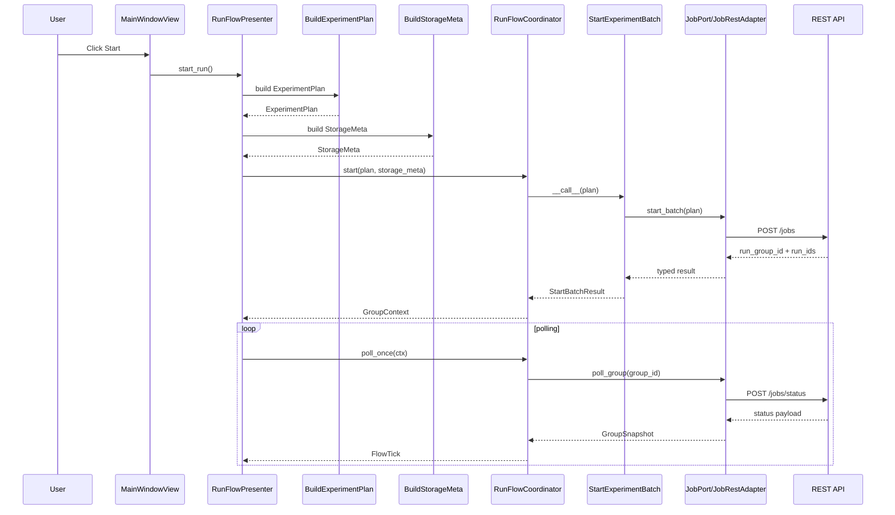
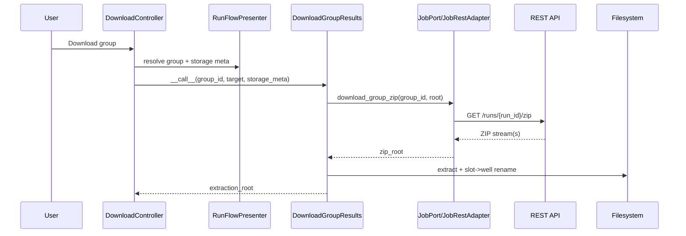
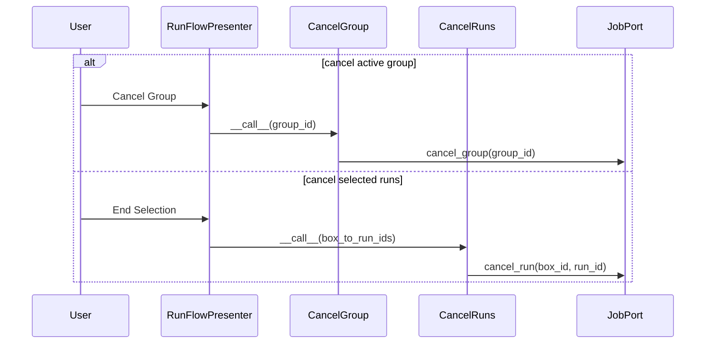
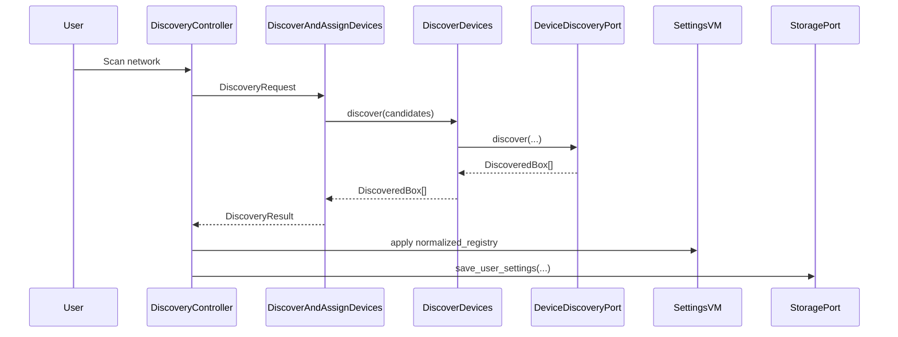

# SEVA Workflows

This document maps GUI actions to use cases in `seva/usecases`, then to adapter ports/endpoints. The goal is to make run orchestration and diagnostics traceable end-to-end.

## Layer Contract (MVVM + Hexagonal)

- Views (`seva/app/views/*`) emit callbacks only.
- ViewModels (`seva/viewmodels/*`) hold UI state only.
- UseCases (`seva/usecases/*`) orchestrate workflow and validation.
- Adapters (`seva/adapters/*`) perform I/O and API payload transport.
- Server status remains authoritative for progress and phase information.

## UI Entrypoints and Handoffs

Main composition happens in `seva/app/main.py` where callbacks are wired to presenter/controller actions.

- `MainWindowView.on_submit` -> `App._on_submit()` -> `RunFlowPresenter.start_run()`.
- `MainWindowView.on_cancel_group` -> `App._on_cancel_group()` -> `RunFlowPresenter.cancel_active_group()`.
- `ExperimentPanelView.on_end_selection` -> `App._on_end_selection()` -> `RunFlowPresenter.cancel_selected_runs()`.
- `MainWindowView.on_save_layout` / `on_load_layout` -> `SavePlateLayout` / `LoadPlateLayout`.
- Settings dialog test/scan/remote-update/flash actions -> `SettingsController` and `DiscoveryController` use-case calls.
- `DownloadController.download_group_results()` handles run-artifact downloads.

## Workflow 1: Start -> Poll -> Complete

1. `RunFlowPresenter.start_run()` gathers configured wells from `PlateVM` and per-well mode snapshots from `ExperimentVM`.
2. `BuildExperimentPlan` validates typed snapshots and builds `ExperimentPlan`.
3. `BuildStorageMeta` builds `StorageMeta` from plan metadata and settings.
4. `RunFlowCoordinator.start()` calls `StartExperimentBatch`.
5. `StartExperimentBatch` delegates to `JobPort.start_batch` (`JobRestAdapter.start_batch` -> `POST /jobs`).
6. Presenter stores run metadata in `RunsRegistry`, schedules polling, and updates `ProgressVM`/`RunsVM`.
7. Poll ticks call `RunFlowCoordinator.poll_once()` -> `PollGroupStatus`.
8. `PollGroupStatus` calls `JobPort.poll_group` (`JobRestAdapter.poll_group` -> `POST /jobs/status`) and normalizes to `GroupSnapshot`.
9. On completion (`snapshot.all_done`), coordinator optionally auto-downloads via `DownloadGroupResults`.

Outcome: a typed plan is submitted once, server snapshots drive all progress updates, and completion can trigger download automatically.

## Workflow 2: Download Group Results

1. User triggers download from run overview/runs panel.
2. `DownloadController` resolves active group and metadata from `RunFlowPresenter`.
3. `DownloadGroupResults` validates `StorageMeta` and calls `JobPort.download_group_zip`.
4. `JobRestAdapter.download_group_zip` fetches per-run archives (`GET /runs/{run_id}/zip`).
5. Use case extracts ZIPs, renames `slotNN` folders to well IDs via adapter slot registry, and applies cleanup mode (`keep|delete|archive`).

Outcome: results are unpacked under `<results>/<experiment>/<subdir?>/<client_datetime>/...` with deterministic well folder names.

## Workflow 3: Cancellation

- Group cancel: `RunFlowPresenter.cancel_active_group()` -> `CancelGroup` -> `JobPort.cancel_group`.
- Selected-run cancel: `RunFlowPresenter.cancel_selected_runs()` -> `CancelRuns` -> `JobPort.cancel_run` per unique run id.
- Errors from adapters are mapped by `map_api_error` to stable `UseCaseError` codes/messages.

Outcome: cancellation orchestration stays in use cases, with shared error semantics.

## Workflow 4: Discovery and Assignment

1. `DiscoveryController.discover()` builds candidates from configured base URLs and subnet hints.
2. `DiscoverAndAssignDevices` calls `DiscoverDevices` (`DeviceDiscoveryPort.discover`, usually `HttpDiscoveryAdapter`).
3. Discovered URLs are merged via `MergeDiscoveredIntoRegistry`.
4. Empty configured slots are assigned in order; overflow URLs are reported as skipped.
5. Updated registry is pushed to `SettingsVM` and persisted via `StoragePort.save_user_settings`.

Outcome: reachable devices are discovered and assigned to open slots without manual URL editing.

## Workflow 5: Settings remote update and firmware control

1. User selects update ZIP in settings dialog (`SettingsDialog`).
2. `SettingsController` calls `UploadRemoteUpdate` per configured box.
3. `UploadRemoteUpdate` delegates to `UpdatePort.start_update` (`UpdateRestAdapter` -> `POST /updates`).
4. Poll timer in `SettingsController` calls `PollRemoteUpdateStatus`.
5. `PollRemoteUpdateStatus` delegates to `UpdatePort.get_update_status` (`UpdateRestAdapter` -> `GET /updates/{update_id}`).
6. UI renders server-authored step/component status; no client-derived progress states are fabricated.
7. Optional staged flash action calls `FlashStagedFirmware` -> `FirmwarePort.flash_staged_firmware` (`POST /firmware/flash/staged`).
8. Version panel refresh calls `FetchBoxVersionInfo` -> `UpdatePort.get_version_info` (`GET /version`).

Outcome: settings now use one ZIP-driven update workflow with explicit polling/status and a separate staged-firmware flash action.

## Workflow 6: Diagnostics and Control

- `TestConnection`: settings test action -> `DevicePort.health` + `DevicePort.list_devices` (REST: `/health`, `/devices`).
- `PollDeviceStatus`: periodic activity polling -> `DevicePort.list_device_status` + `list_devices` -> `DeviceActivitySnapshot` for `ProgressVM`.
- `TestRelay`: relay diagnostics action -> `RelayPort.test`.
- `SetElectrodeMode`: electrode mode toggle -> `RelayPort.set_electrode_mode`.

Outcome: diagnostics remain adapter-agnostic at use-case level while surfacing typed status to the UI.

## Workflow 7: Layout Persistence

1. Save action calls `SavePlateLayout` with `ExperimentVM` state (selection + per-well params).
2. `StoragePort.save_layout` persists payload.
3. Load action calls `LoadPlateLayout`.
4. `LoadPlateLayout` normalizes payload and reapplies it to `ExperimentVM` and `PlateVM`.

Outcome: plate configurations round-trip through storage without view-level file I/O logic.

## UseCase Inventory (Trigger -> Adapter/Port)

- `apply_ir_correction.ApplyIRCorrection`: processing hook placeholder; currently passthrough, no adapter call.
- `build_experiment_plan.BuildExperimentPlan`: run start path from presenter; no adapter call.
- `build_storage_meta.BuildStorageMeta`: run start/download metadata preparation; no adapter call.
- `start_experiment_batch.StartExperimentBatch`: run start; `JobPort.start_batch`.
- `poll_group_status.PollGroupStatus`: run polling; `JobPort.poll_group`.
- `download_group_results.DownloadGroupResults`: download flow; `JobPort.download_group_zip` + filesystem.
- `cancel_group.CancelGroup`: cancel active group; `JobPort.cancel_group`.
- `cancel_runs.CancelRuns`: cancel selected runs; `JobPort.cancel_run`.
- `run_flow_coordinator.RunFlowCoordinator`: orchestration wrapper around start/poll/download use cases.
- `discover_devices.DiscoverDevices`: settings scan; `DeviceDiscoveryPort.discover`.
- `discover_devices.MergeDiscoveredIntoRegistry`: settings scan helper; no adapter call.
- `discover_and_assign_devices.DiscoverAndAssignDevices`: scan + assignment orchestration; discovery port via nested use case.
- `test_connection.TestConnection`: settings connection test; `DevicePort.health` + `DevicePort.list_devices`.
- `poll_device_status.PollDeviceStatus`: activity polling; `DevicePort.list_device_status` + `DevicePort.list_devices`.
- `upload_remote_update.UploadRemoteUpdate`: settings remote update upload; `UpdatePort.start_update`.
- `poll_remote_update_status.PollRemoteUpdateStatus`: settings remote update polling; `UpdatePort.get_update_status`.
- `fetch_box_version_info.FetchBoxVersionInfo`: settings version panel refresh; `UpdatePort.get_version_info`.
- `flash_staged_firmware.FlashStagedFirmware`: settings staged flash action; `FirmwarePort.flash_staged_firmware`.
- `test_relay.TestRelay`: relay diagnostics; `RelayPort.test`.
- `set_electrode_mode.SetElectrodeMode`: relay control; `RelayPort.set_electrode_mode`.
- `save_plate_layout.SavePlateLayout`: toolbar save layout; `StoragePort.save_layout`.
- `load_plate_layout.LoadPlateLayout`: toolbar load layout; `StoragePort.load_layout`.
- `error_mapping.map_api_error`: shared adapter-error to use-case-error mapping utility.
- `load_device_status` module: reserved for future orchestration.
